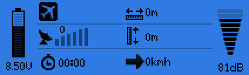
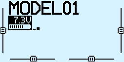

# opentx-lua-widgets [](https://travis-ci.org/Matze-Jung/opentx-lua-widgets)

**Telemetry screen grid-system for OpenTX**

slim, auto-scaling, nestable, open

###  
Create your personal telemetry screens with ease:

[")](https://github.com/Matze-Jung/opentx-lua-widgets/blob/master/src/SCRIPTS/TELEMETRY/wdgts1.lua)
[")](https://github.com/Matze-Jung/opentx-lua-widgets/blob/master/src/SCRIPTS/TELEMETRY/wdgts3.lua)
[")](https://github.com/Matze-Jung/opentx-lua-widgets/blob/master/src/SCRIPTS/TELEMETRY/wdgts2.lua)

>  \**graph-widget integrates from [opentx-lua-running-graphs](https://github.com/Matze-Jung/opentx-lua-running-graphs)*

## Download
Please go to the [releases page](https://github.com/Matze-Jung/opentx-lua-widgets/releases) to download the latest files.

## Test environment
* [OpenTX v2.3.2](https://github.com/opentx/opentx) on FrSky Taranis Q X7
* [OpenTX Companion v2.3.2](https://www.open-tx.org/) (all FrSky Taranis platforms, Jumper T12)

## File structure
- `TELEMETRY/` telemetry screen examples


- `WIDGETS/` widgets for X7/X9 displays, see script head for details on each
    * `X9/` widgets for X9 displays only
    * `widgets.lua` main script

## API
### Screen layout
The `layout` table:

| Name | Type | Description |
| - | - | - |
| **column** | table | - |
| **cell** | table | - |
| cell.**id** | string *(optional, default empty zone)* | path/widget name without extension, `id=""` draws a rectangle |
| cell.**opts** | table *(optional)* | pass configuration options to widget |
| cell.opts.**parent** | bool *(optional, default `false`)* | set `true` to load a nested grid |

```lua
local layout = {
    { -- column A
        {id=""} -- cell A1
    },
    { -- column B
        {id=""} -- cell B1
    },
    { -- column C
        {id=""}, -- cell C1
        {id=""} -- cell C2
    }
}
```
**X7** [](https://github.com/Matze-Jung/opentx-lua-widgets/blob/master/README.md#screen-layout)

**X9** [](https://github.com/Matze-Jung/opentx-lua-widgets/blob/master/README.md#screen-layout)

##  
`SCRIPTS/TELEMETRY/lynix.lua`

```lua
-- X9 layout based on https://github.com/lynix/opentx-telemetry
local layout = {
    { -- column A
        {id="X9/tx-batt"} -- cell A1
    },
    { -- column B
        {id="X9/mode"}, -- cell B1
        {id="X9/gps"}, -- cell B2
        {id="X9/timer"} -- cell B3
    },
    { -- column C
        {id="X9/distance"}, -- cell C1
        {id="X9/altitude"}, -- cell C2
        {id="X9/speed"} -- cell C3
    },
    { -- column D
        {id="X9/rssi"} -- cell D1
    },
}
```
[](https://github.com/Matze-Jung/opentx-lua-widgets/blob/master/src/SCRIPTS/TELEMETRY/lynix.lua)

### Options
Widgets have different options depending on how they're designed. Look at the head description of the widget scripts for further details (like [value.lua](https://github.com/Matze-Jung/opentx-lua-widgets/blob/master/src/SCRIPTS/WIDGETS/value.lua)).
Use [tmpl.lua](https://github.com/Matze-Jung/opentx-lua-widgets/blob/master/src/SCRIPTS/WIDGETS/tmpl.lua) to create new widgets from scratch.

Some common parameters are:

| Name | Type | Description |
| - | - | - |
| opts.**src** | function *or* sensor-ID string/number | Data source |
| opts.**lbl** | string *(optional)* | Label text at top |
| opts.**m** | table *(optional, defaults depend)* | Cell margin in px `[t=top, r=right, b=bottom, l=left]` |

> *Currently options are not implemented in X9 widgets.*

### Nesting
`SCRIPTS/TELEMETRY/wdgts2.lua`
```lua
[...]
        { id="../TELEMETRY/wdgts2_sub", opts={parent=1} },
[...]
```
To create a nested grid, set `opts.parent` to a `true` value in the parent layout ...

`SCRIPTS/TELEMETRY/wdgts2_sub.lua`
```lua
[...]
local w = assert(loadScript("/SCRIPTS/WIDGETS/widgets.lua"))(layout, 1)
[...]
```
... and the second parameter of the main script call to a `true` value inside the encapsulated layout.

> *Try to use margin instead of nesting where possible to preserve memory.*

**X7** [](https://github.com/Matze-Jung/opentx-lua-widgets#nesting)

**X9** [](https://github.com/Matze-Jung/opentx-lua-widgets#nesting)

## Installing
Unzip the files from the release package and drag the contents to your radio. If you do this correctly, the `SCRIPTS` directory will merge with your existing directories, placing the scripts in their appropriate paths.

The `src` directory is not required for use and is only available for maintenance of the code. However, the use of the `src` directory may work because the current OpenTX compiles its LUAC files at runtime.

**How to copy to the Transmitter:**

**A**) Bootloader Method
1. Power off your transmitter and power it back on in boot loader mode.
2. Connect a USB cable and open the SD card drive on your computer.
3. Unzip the file and copy the scripts to the root of the SD card.
4. Unplug the USB cable and power cycle your transmitter.

**B**) Manual method (varies, based on the model of your transmitter)
1. Power off your transmitter.
2. Remove the SD card and plug it into a computer
3. Unzip the file and copy the scripts to the root of the SD card.
4. Reinsert your SD card into the transmitter
5. Power up your transmitter.

Go to the telemetry screen setup page and select telemetry pages.

## Setup
Setting up the script as a telemetry page will enable access at the press of a button (on X7/X9 platforms).
1. Hit the [MENU] button and select the model for which you would like to enable the script.
2. While on the `MODEL SELECTION` screen, long-press the [PAGE] button to navigate to the `DISPLAY` page.
3. Move the cursor to a free screen and hit [ENT].
4. Select the `Script` option and press [ENT].
5. Move the cursor to the script selection field `---` and hit [ENT].
6. Select one of the listed telemetry scripts and hit [ENT].
7. Long-press [EXIT] to return to your model screen.

[](https://github.com/Matze-Jung/opentx-lua-widgets#setup)

To invoke the script, simply long-press the [PAGE] button from the model screen.

### Memory warning
If you just copied the files, launched the script and a `not enough memory` warning appears at some point, probably restarting the radio is the only thing to do here. If OpenTX is still complaining, try reboot the system several times.

## Building from source
- Be sure to have `LUA 5.2`and `Node.js` installed
- Run `npm install` from the root folder to install node modules
- Run `npm start`, `make` or `./bin/build.sh min` from the root folder with appropriate privileges (omit the `min` switch to build without minifying)
- Compiled/minified files will be created at the `obj` folder. Copy the files to your transmitter.

## Resources
* [Manual for OpenTX 2.2](https://opentx.gitbooks.io/manual-for-opentx-2-2)
* [OpenTX 2.2 Lua Reference Guide](https://opentx.gitbooks.io/opentx-2-2-lua-reference-guide/)
* [OpenTX Taranis Manual](https://opentx.gitbooks.io/opentx-taranis-manual)

##  
*This Project is inspired from [olimetry.lua](https://www.youtube.com/watch?v=dMNDhq2QJv4) by Ollicious (bowdown@gmx.net)*
